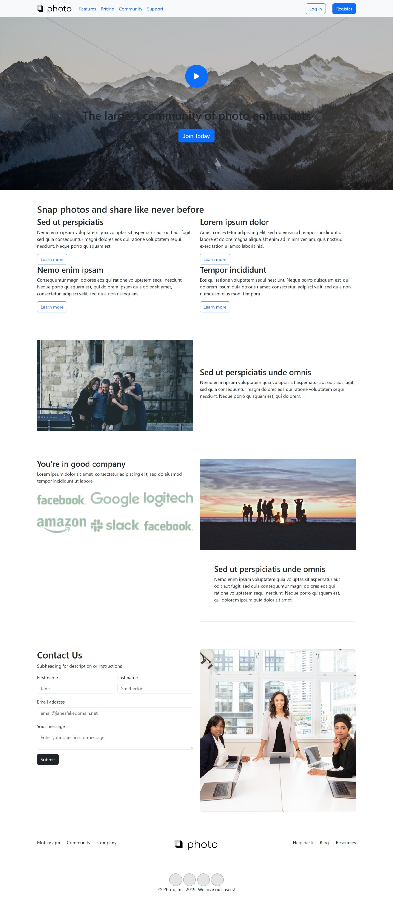
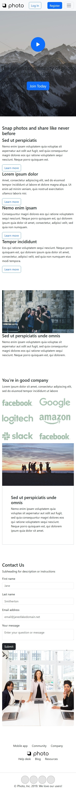

# 🌐 Responsive Landing Page | HTML, CSS, Bootstrap 5

A modern, fully responsive landing page built using **HTML, CSS, and Bootstrap 5**.  
The design is mobile-first, clean, and optimized for all screen sizes.

---

## 🚀 Live Demo

[🔗 View Project on GitHub Pages](https://abdullahh74.github.io/Responsive-Landing-Page-HTML-CSS-Bootstrap/)

---

## 🛠️ Technologies Used

- **HTML5** – Semantic and accessible structure
- **CSS3** – Custom styling
- **Bootstrap 5** – Responsive grid system and UI components

---

## ✨ Features

- 💻 Fully responsive across all screen sizes
- 🎨 Modern and clean UI design
- ⚡ Fast loading and performance optimized
- 🧩 Navbar, Hero section, Features, and Footer
- 📱 Mobile-first layout

---

## 📸 Screenshots

---

## 📂 Folder Structure

📁 responsive-landing-page-bootstrap
 ┣ 📂 images
 ┣ 📜 index.html
 ┣ 📜 style.css
 ┗ 📜 README.md

